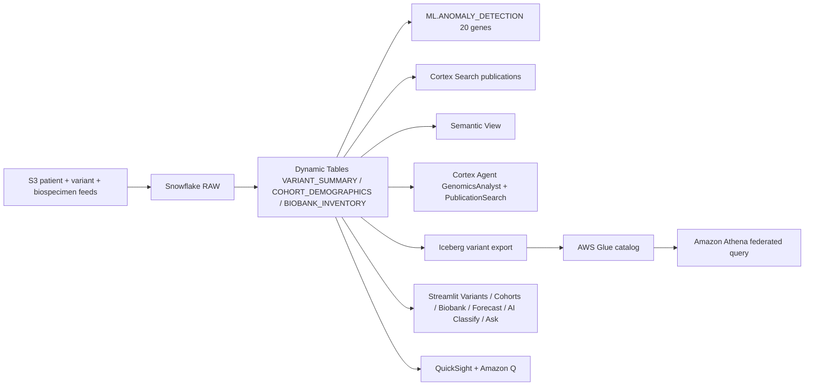

# Genomics & Research Data Platform

Snowflake-powered precision medicine platform demonstrating variant analysis, cohort comparison, AI-driven variant interpretation, biobank management, and Iceberg-based data lake export for interoperability with AWS Glue and Athena.

## Architecture

A precision-medicine genomics platform built on **Snowflake** (Dynamic Tables, ML.ANOMALY_DETECTION, Cortex Search, semantic view, Cortex Agent) and **AWS** (S3, Apache Iceberg, AWS Glue, Athena, QuickSight + Amazon Q). Variants and biospecimens land in RAW; Snowflake builds the curated layer; Iceberg makes the variant catalog queryable from Athena and QuickSight.



## Personas

| Persona | Role | Key Questions |
|---------|------|---------------|
| **Dr. Sarah Chen** | Principal Investigator | "Which patients carry the reclassified variant?" "Show me BRCA1 co-occurrence patterns." |
| **Dr. James Park** | Research Director | "What's our biobank utilization?" "Export the affected cohort to the data lake." |

## Data

| Table | Rows | Description |
|-------|------|-------------|
| PATIENTS | 5,000 | 2 cohorts: Responders / Non-Responders |
| VARIANTS | 100,000 | 20 genes, deliberate BRCA1 pathogenic skew in responders |
| BIOSPECIMENS | 20,000 | Blood, tissue, plasma, DNA |
| PHENOTYPES | 30,000 | Clinical phenotype observations |
| PUBLICATIONS | 200 | Research papers with abstracts for Cortex Search |
| COHORT_DEFINITIONS | 50 | Reusable cohort criteria |

## Build Instructions

### Prerequisites
- Snowflake account with ACCOUNTADMIN access
- Cortex AI enabled (ML Functions, Search, Agent)
- Warehouse: CORTEX (Medium)
- AWS CLI with S3, Glue, QuickSight access

### Deployment

```bash
snowsql -f snowflake/00_setup.sql
snowsql -f snowflake/01_integrations.sql
snowsql -f snowflake/02_raw_tables.sql
snowsql -f snowflake/03_curated.sql
snowsql -f snowflake/04_search.sql
snowsql -f snowflake/05_ml.sql
snowsql -f snowflake/06_semantic.sql
snowsql -f snowflake/07_agent.sql
snowsql -f snowflake/08_iceberg.sql
```

### Streamlit App
```
HEALTHCARE_GENOMICS.APP.GENOMICS_PLATFORM_APP
```

## Key Demo Numbers

- **VUS reclassification crisis** — BRCA1 rs121913279 upgraded to PATHOGENIC
- **200+ affected patients** require immediate clinical re-notification
- **100,000 variants** across 20 genes with anomaly detection
- **Iceberg export** — affected cohort accessible from Athena for clinical follow-up

## License

Apache 2.0 — See [LICENSE](LICENSE) for details.
